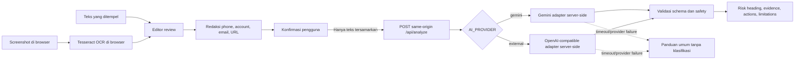

# CekDulu

**Sebelum klik atau transfer, CekDulu.**

CekDulu membantu pengguna memahami mengapa sebuah pesan mungkin berisiko dan apa yang sebaiknya diverifikasi sebelum membuka tautan, membagikan data, atau mentransfer uang. CekDulu adalah asisten pemeriksa risiko, bukan penentu bahwa pesan pasti aman atau pasti penipuan.

Production tersedia di [https://cekdulu-gamma.vercel.app](https://cekdulu-gamma.vercel.app). Deployment terbaru telah diverifikasi pada commit `4bb749cd94351f38bb09b890a09c5a1e992a7b84`.

## Arsitektur



Screenshot tetap berada pada alur browser OCR. Worker, core/WASM, dan data bahasa Tesseract untuk `eng`/`ind` dilayani dari origin CekDulu sendiri. Teks mentah dapat diedit dalam state komponen, tetapi hanya teks tersamarkan yang dikonfirmasi pengguna yang dikirim ke API same-origin. API key hanya dibaca server. `AI_PROVIDER` memilih tepat satu adapter; aplikasi tidak melakukan automatic cross-provider fallback. Aplikasi tidak memiliki akun, database, message history, URL crawler, owner lookup, atau automatic reporting.

## Prasyarat

- Node.js 26
- npm 12
- Browser Chromium/Chrome untuk Playwright E2E
- Credential untuk satu provider analisis: Gemini atau endpoint external OpenAI-compatible

Versi yang dipakai pada release gate lokal: Node `v26.4.0` dan npm `12.0.2`.

## Instalasi dan environment

```bash
npm ci
cp .env.example .env.local
```

Pilih satu provider secara eksplisit. Contoh Gemini:

```dotenv
AI_PROVIDER=gemini
GEMINI_API_KEY=your-server-only-key
```

Contoh endpoint external OpenAI-compatible:

```dotenv
AI_PROVIDER=external
AI_BASE_URL=https://provider.example/v1
AI_API_KEY=your-server-only-key
AI_MODEL=provider-model-name
# AI_ENABLE_THINKING=false
```

| Variable | Kegunaan |
|---|---|
| `AI_PROVIDER` | Wajib: `gemini` atau `external`. Tidak ada fallback otomatis ke provider lain. |
| `GEMINI_API_KEY` | Wajib saat `AI_PROVIDER=gemini`. |
| `GEMINI_MODEL` | Opsional untuk Gemini; default aplikasi adalah `gemini-3.6-flash`. |
| `AI_BASE_URL` | Wajib saat `AI_PROVIDER=external`; base URL HTTPS untuk API OpenAI-compatible. |
| `AI_API_KEY` | Wajib saat `AI_PROVIDER=external`. |
| `AI_MODEL` | Wajib saat `AI_PROVIDER=external`; nama model ditentukan oleh environment. |
| `AI_ENABLE_THINKING` | Opsional untuk external: literal `true` atau `false`. Jika unset, field tidak dikirim; nilai invalid membuat konfigurasi unavailable. |

Semua key dan konfigurasi provider bersifat **server-only**. Jangan menambahkan prefix `NEXT_PUBLIC_`, jangan menaruh credential dalam source, screenshot, prompt log, atau client bundle. Pada deployment, set variable melalui dashboard deployment dan bukan melalui file yang di-commit.

Jalankan development server:

```bash
npm run dev
```

Buka `http://localhost:3000`.

## Perintah npm

| Perintah | Kegunaan |
|---|---|
| `npm run dev` | Menjalankan Next.js development server. |
| `npm run build` | Membuat production build. |
| `npm run start` | Menjalankan production build yang sudah dibuat. |
| `npm test` | Menjalankan seluruh unit/integration tests sekali. |
| `npm run test:watch` | Menjalankan Vitest dalam watch mode. |
| `npm run test:e2e` | Menjalankan Playwright desktop/mobile E2E. |
| `npm run typecheck` | Menjalankan TypeScript tanpa emit. |
| `npm run lint` | Menjalankan ESLint. |
| `npm run prepare:tesseract` | Menyalin worker, core/WASM, dan data bahasa `eng`/`ind` dari dependency yang dipin ke `public/tesseract/`. Otomatis dijalankan sebelum `dev` dan `build`. |
| `npm run eval:validate -- --development evaluation/development.json` | Memvalidasi 10 development fixtures. |
| `npm run eval -- --dataset evaluation/development.json --base-url http://127.0.0.1:3000 --output evaluation/results/development.json` | Menjalankan development evaluation terhadap server lokal. |

Release gate lokal lengkap:

```bash
npm test
npm run test:e2e
npm run typecheck
npm run lint
npm run build
npm audit --omit=dev
```

## Privacy boundary

- Screenshot diproses oleh OCR di browser; file screenshot tidak dimasukkan ke request `/api/analyze`.
- Tesseract memakai worker, core/WASM, dan data bahasa self-hosted dari path origin-local `/tesseract/`; OCR tidak mengambil asset dari CDN eksternal.
- Teks mentah tetap berada dalam state komponen selama review.
- Phone, account-like number, email, dan URL disamarkan di browser.
- Request API berisi hanya `{ "message": "<confirmed redacted text>" }`.
- Application code tidak menulis request body ke log, tidak menyimpan history, dan tidak memakai database.
- CekDulu tidak membuka atau merayapi URL yang terdapat dalam pesan.

Batas lengkap dan bukti yang sudah diuji ada di [`docs/PRIVACY.md`](docs/PRIVACY.md). CekDulu tidak mengklaim end-to-end encryption atau permanent deletion yang belum diimplementasikan dan diverifikasi.

## Error behavior

File selain PNG/JPEG atau lebih dari 5 MiB ditolak di intake. OCR kosong/gagal mengembalikan panduan crop dan jalur paste-text. Timeout, network failure, provider outage, atau response schema invalid berakhir pada panduan keselamatan umum dan tombol Retry **tanpa risk classification**. Sistem tidak menambahkan rule-based verdict pada jalur fallback.

## Evaluation

Development fixtures dan private holdout dipisahkan. Development set berisi 10 pesan sintetis—dua per kategori—dan boleh dipakai untuk tuning. Private holdout berisi 15 kasus independen—tiga per kategori—dan hanya boleh dijalankan pada official checkpoint setelah prompt dibekukan.

Hasil hanya boleh disebut:

> Agreement with team expected classification; not fraud-detection accuracy.

Jangan menyebut `13/15` sebagai fraud-detection accuracy. Jika sistem berubah setelah official holdout run, hasil tersebut menjadi stale sampai holdout baru ditulis secara independen dan dijalankan.

## Deployment ke Vercel

Production aktif di [https://cekdulu-gamma.vercel.app](https://cekdulu-gamma.vercel.app). Untuk deployment revision berikutnya:

1. Buat atau gunakan project Vercel bernama `cekdulu`.
2. Set `AI_PROVIDER` dan variable provider yang sesuai pada dashboard untuk production environment.
3. Pastikan tidak ada API key dengan prefix `NEXT_PUBLIC_`.
4. Deploy release commit:

   ```bash
   npx vercel --prod
   ```

5. Jalankan checklist fresh-browser/incognito pada [`docs/DEMO.md`](docs/DEMO.md): built-in sample, screenshot, paste, timeout, mobile, official link, dan reset.
6. Catat URL serta commit yang benar-benar dideploy sebelum merekam backup video.

Deployment dan incognito verification tidak boleh ditandai lulus hanya berdasarkan build lokal.

## Sumber resmi dan afiliasi

- [Indonesia Anti-Scam Centre (IASC) — OJK](https://iasc.ojk.go.id/)
- [OJK — Infografis RDKB Mei 2026](https://www.ojk.go.id/id/Publikasi/Infografis/Pages/Infografis-RDKB-Mei-2026.aspx)

CekDulu adalah proyek independen untuk hackathon. CekDulu **tidak berafiliasi dengan WhatsApp, bank mana pun, OJK, atau IASC**. Tautan resmi disediakan agar pengguna dapat membuka panduan melalui kanal terpisah; CekDulu tidak mengirim laporan otomatis ke lembaga tersebut.

## Dokumen lanjutan

- [`docs/PRIVACY.md`](docs/PRIVACY.md) — data flow, batas klaim, dan bukti privacy.
- [`docs/DEMO.md`](docs/DEMO.md) — choreography demo 2–3 menit dan timeout rehearsal.
- [`docs/ai/PROMPT_LOG.md`](docs/ai/PROMPT_LOG.md) — bukti workflow AI/vibecoding tanpa secret atau private data.
- [`docs/hackathon/HACKATHON.md`](docs/hackathon/HACKATHON.md) — scope, rubric evidence, alignment, dan submission status.
